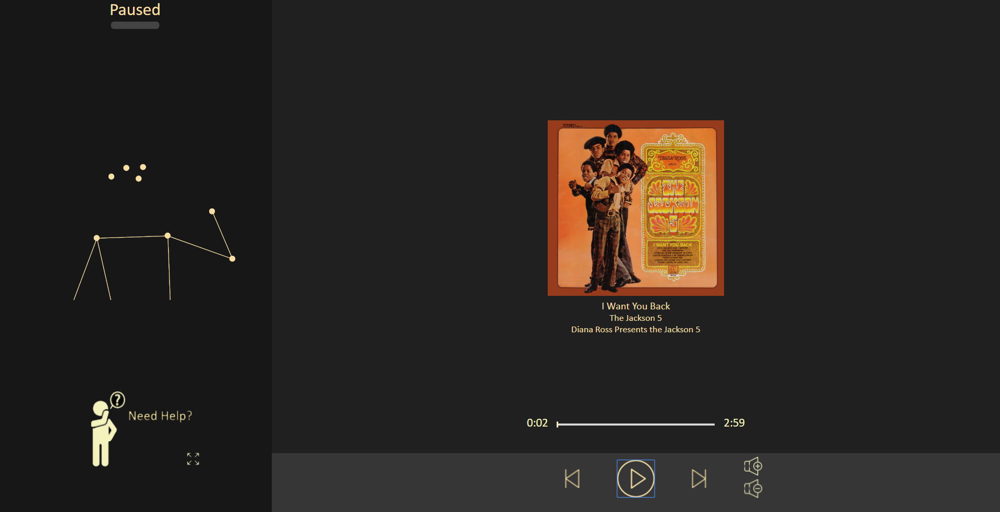
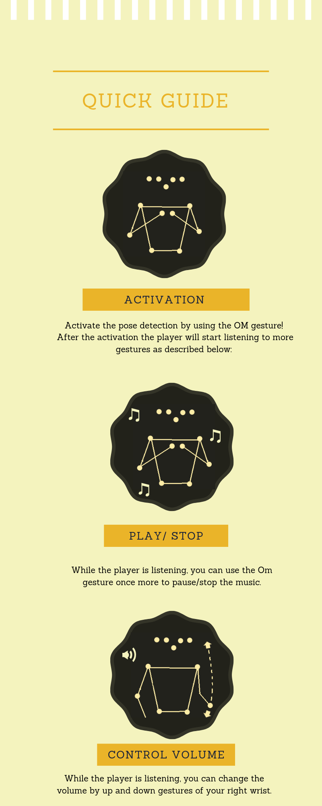

# BumbleBeat 

BumbleBit is a gestured-based music player written in JavaScript. The target of the app is 
to free users from the need to be close to any sort of controller in order to affect music flow.

The pose detection itself is preformed by TensorFlow's PoseNet library ([see here](https://www.tensorflow.org/lite/models/pose_estimation/overview))
We also used Youtube's API in order to load a few example songs.

## Usage
In order to run BumbleBit, simply run PerceptualComputingProj\BumbleBit\BumbleBit.html. 
The interface is pretty simple, it is described in this guide we made:

